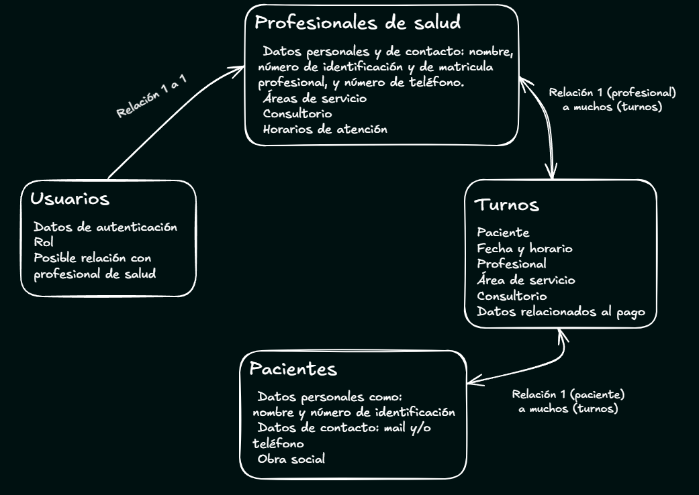
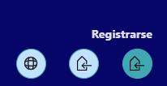
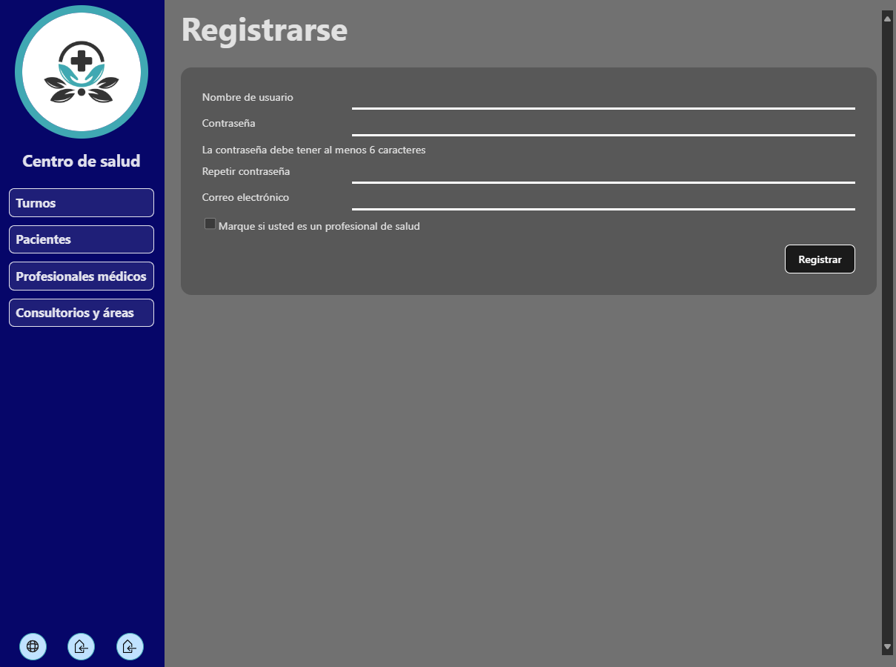
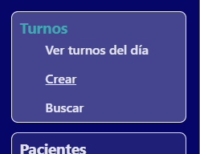
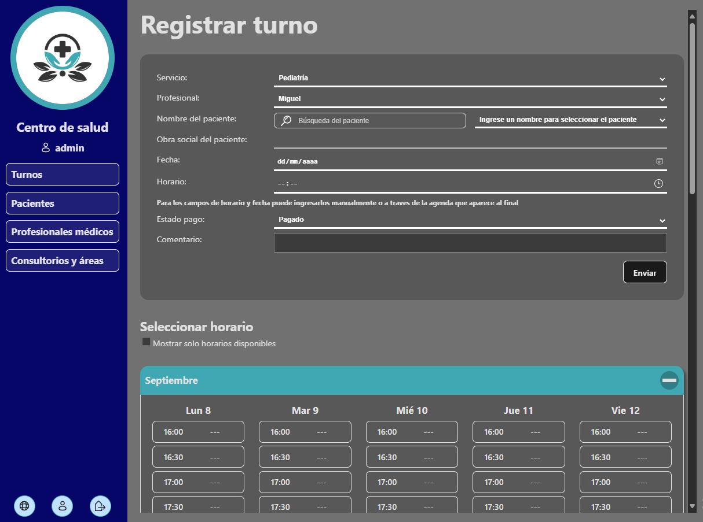
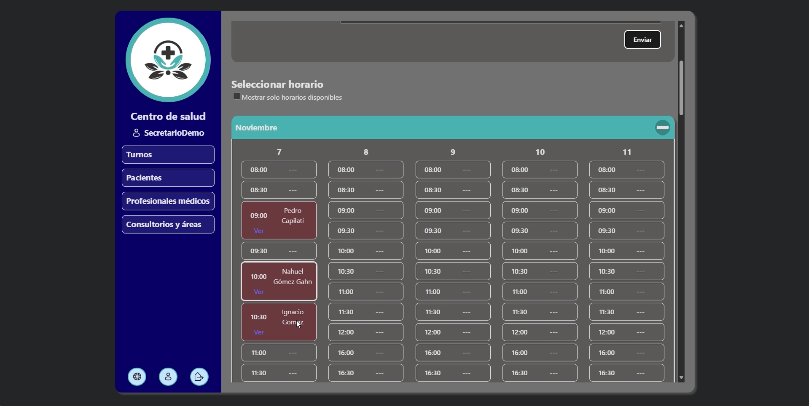
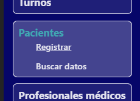
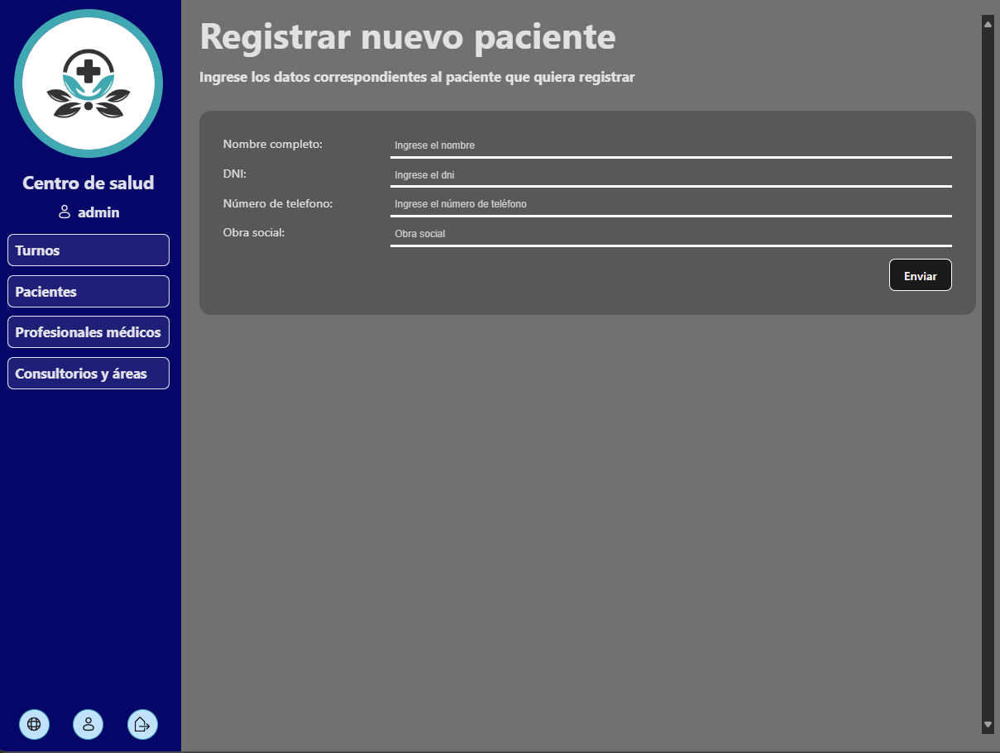
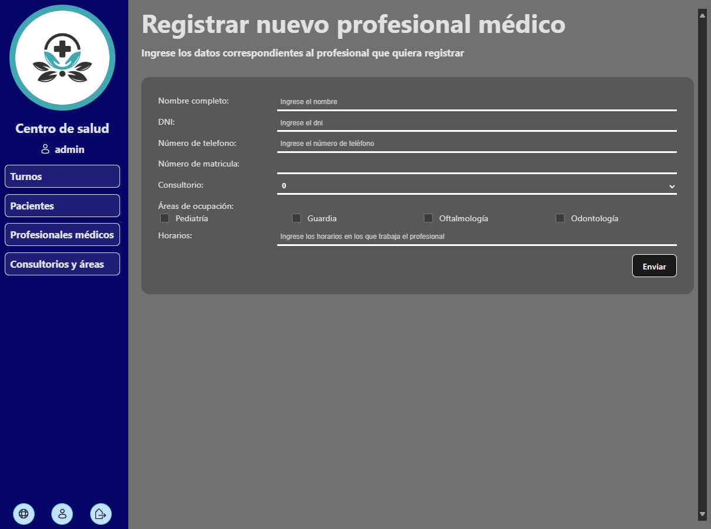

<div style="display:flex;width:100%;justify-content:center;">
  <a href="https://github.com/GGNahuel/08-AdministracionTurnosClinica/blob/main/README_ENG.md"><h4>To see this documentation in english click here</h4></a>
</div>
<h1>Administrador de turnos para centro de salud</h1>

Este proyecto está pensado como una herramienta para ayudar en la gestión de turnos, entro otras cosas, en centros de salud como clínicas u hospitales. **Permite crear y gestionar turnos, así como también manejar datos de, pacientes, profesionales de salud y areas de servicio**.

Permite acceder a la información de forma sencilla mediante **búsquedas personalizadas y visualizaciones en tablas.** La información se registra a través de **formularios claros**, o herramientas prácticas que permitan realizar las acciones de forma gráfica y fácil de entender.

La página cuenta con varias opciones de seguridad. Una de ellas, de las más útiles en el uso diario que pueda tener, es la protección de datos utilizando la **sesión del usuario**. Es decir, según la cuenta que inicia sesión, y los roles que ésta tenga, son los datos que se pueden agregar, modificar, o eliminar.

**Índice**
- [Fundamentación de Arquitectura y diseño de software](#fundamentación-de-arquitectura-y-diseño-de-software)
  - [Estilo arquitectónico](#estilo-arquitectónico)
  - [Modelo de dominio](#modelo-de-dominio)
    - [Turnos](#turnos)
    - [Pacientes](#pacientes)
    - [Profesionales de salud](#profesionales-de-salud)
    - [Usuarios](#usuarios)
  - [Resumen de tecnologías y herramientas elegidas](#resumen-de-tecnologías-y-herramientas-elegidas)
  - [Patrón arquitectónico](#patrón-arquitectónico)
    - [Capa del modelo](#capa-del-modelo)
    - [Capa de vista](#capa-de-vista)
      - [Vistas](#vistas)
    - [Capa de controlador](#capa-de-controlador)
  - [Seguridad y autenticaciones](#seguridad-y-autenticaciones)
    - [Roles disponibles](#roles-disponibles)
    - [Validación de datos](#validación-de-datos)
  - [Entornos](#entornos)
- [Instrucciones de instalación y requisitos](#instrucciones-de-instalación-y-requisitos)
  - [Variables de entorno](#variables-de-entorno)
  - [En caso de usar docker](#en-caso-de-usar-docker)
  - [En caso de no usar docker](#en-caso-de-no-usar-docker)
    - [Windows](#windows)
    - [Linux / macOS](#linux--macos)
- [Guía de operaciones](#guía-de-operaciones)
  - [Registrar nuevo usuario](#registrar-nuevo-usuario)
  - [Inicio de sesión](#inicio-de-sesión)
  - [Registrar turnos](#registrar-turnos)
  - [Registrar pacientes](#registrar-pacientes)
  - [Registrar profesionales de salud](#registrar-profesionales-de-salud)
  - [Registro de áreas de servicio y consultorios](#registro-de-áreas-de-servicio-y-consultorios)
- [Comentarios del proceso](#comentarios-del-proceso)

## Fundamentación de Arquitectura y diseño de software
La aplicación entonces tiene como objetivo la gestión de turnos, tanto para secretarios como para profesionales. 

Está destinada a centros de salud, pero cada uno tendría su propia instancia de la misma. Es decir que no está pensada como una aplicación que estaría alojada en algún servidor remoto con acceso global, sino más bien a una aplicación de ejecución local. Y por lo tanto ésta debería trabajar con datos relacionados al ámbito de salud y para el fin mencionado. Lo que implicaría:

Que debe brindar:
- Una interfaz fácil de entender y de acceder a las distintas acciones que se quieran realizar.
- La posibilidad de tanto visualizar como de registrar turnos en el corto y largo plazo.
- El registro de pacientes y personal de salud.
- La asociación de esos pacientes y profesionales a los turnos.
- Permitir que cada profesional pueda acceder y manejar los turnos con los que se encuentre asociado.
- Dar la seguridad de que no se permitiría que los turnos se sobrepongan para un mismo profesional.

Y que el sistema debería:
- Poder guardar los datos de forma persistente en él.
- Además de una interfaz clara, éste debería tener su API que permita comunicarse con la base de datos de forma práctica.
- Que el lado de la interfaz y el lado del servidor estén en constante comunicación, y las operaciones puedan tener respuesta sincrónica.
- Guardar datos sensibles de forma segura, por ejemplo encriptando contraseñas y validando los parámetros que ingresan en las solicitudes.
- Trabajar con autenticaciones y autorizaciones en sus operaciones.
- Exponerse dentro de la red local, para que pueda ser accedida desde distintos dispositivos en el área del centro de salud.
- Realizar back-ups periódicamente para la conservación de datos.

### Estilo arquitectónico
Analizando las necesidades del proyecto se llegó a la conclusión de que la mejor opción para este caso sería un sistema monolítico, ya que no requiere de tanta complejidad ni está pensada una gran escalabilidad para este caso. Aprovechando entonces la facilidad de desarrollo y la simpleza en su infraestructura que permiten estos sistemas.

El proyecto, con esta arquitectura monolítica, constaría de:
- Una base de datos.
- Una API a la que accede la interfaz y que se comunica con la base de datos para las operaciones que los usuarios deseen realizar.
- Y una interfaz, capaz de mostrar y permitir realizar de forma clara todo el trabajo que está pensado para la aplicación.

### Modelo de dominio
Estando destinada a la gestión de turnos para centros de salud debería contar con las siguientes entidades como centro del proyecto: turnos, pacientes y profesionales de salud principalmente.

Como a la aplicación podrían acceder distintos usuarios, también se necesitaría de una entidad que maneje y guarde estos datos. Que serán usados para autenticarse y validar los distintos roles.

Aspectos adicionales que se asignaron o que se tuvieron en cuenta:
- Un profesional de salud puede estar registrado en más de un área de servicio si se requiere.
- Los consultorios solo pueden tener un profesional asignado.
- Entre los datos de pacientes estaría el de obra social. Dato que serviría también al momento de crear turnos.
- Es posible que en el centro de salud donde se use haya áreas que sean sin turnos fijos, sin fecha y horario, sino más bien por orden de llegada. Pero que igual se necesita registrar los datos de pacientes y de abono.

**Representación gráfica del modelo:**
<div style="display: flex; justify-content: center">
</div>

#### Turnos
Esta entidad guardaría los datos que corresponden a cada turno. Relacionándose con pacientes, profesionales, asignando fecha, horario, consultorio, entre otras cosas.

Atributos:
- Paciente que solicita (Relación muchos a 1)
- Fecha
- Horario
- Área de servicio
- Profesional de salud (Relación muchos a 1)
- Consultorio
- Estado de pago (Pagado, Debe documentación, Debe, o A Reiterar)
- Obra social (si aplica se le asignaría la que tiene el paciente)

#### Pacientes
Entidad destinada a cada paciente, se registraría uno nuevo cada vez que alguien pide un turno por primera vez en el centro de salud.

Atributos:
- Nombre completo
- DNI (o número de identificación según corresponda el país)
- Número de teléfono
- Obra social

#### Profesionales de salud
Encargados de tener asociados los turnos que le corresponden, además de datos personales y profesionales. Pudiendo manejar también sus propios turnos

Atributos:
- Nombre completo
- DNI (o número de identificación según corresponda el país)
- Número de teléfono
- Número de matricula profesional
- Áreas de servicio (El profesional puede estar en distintas áreas según su formación e infraestructura del centro de salud)
- Consultorio (1 profesional solo puede tener 1 consultorio para este caso)
- Horarios de atención

#### Usuarios
Que servirán para guardar los datos relacionados a autenticaciones al sistema. Lo que según el rol del usuario se habilitarían distintas funciones.

Atributos:
- Nombre de usuario
- Contraseña
- Rol
- Email (para recuperación de datos)
- Profesional de salud (En caso de que esté relacionado con uno. Relación 1 a 1)

### Resumen de tecnologías y herramientas elegidas
| Tecnología / herramienta | Comentario adicional |
| - | - |
| Java y Spring Boot | <p>El uso de este conjunto aporta varias facilidades.</p> <p>Por el lado del lenguaje, Java, brinda la madurez y soporte que posee, además de que es común su uso aplicaciones.</p> <p>Y con respecto a Spring Boot, éste brinda la facilidad de sus configuraciones automáticas en sus componentes y del despliegue de aplicaciones Java. También ofrece distintos módulos que se requerían en este proyecto. Pensando principalmente en el de seguridad, Spring Security; además de otros que sirven para desarrollar gateways, APIs REST y GraphQL, y trabajo con bases de datos relacionales.</p> |
| Spring security | Fundamental para manejar las autenticaciones, autorizaciones, validaciones y algunas protecciones necesarias para la seguridad de la aplicación. |
| API Rest | Elegida ya que es la que más se adapta al proyecto debido a su que forma de comunicación y obtención de respuestas es sincrónica, necesaria para esta aplicación. Además no es fundamental el filtrado de datos enviados o recibidos de las solicitudes a la API, por lo que no hacen falta tecnologías como GraphQL. |
| Base de datos Relacional - MySQL | Las bases de datos relacionales son ampliamente usadas en entornos como para el que está pensada la aplicación, debido a las relaciones que permiten y la estructura que le brinda a sus componentes. |
| TypeScript | Aporta estructura y rigidez a todo el frontend, lo que hace que se sincronice con las características del backend en Java. |
| React | Se eligió React por su enfoque en componentes reutilizables, rendimiento mediante Virtual DOM, ecosistema maduro, compatibilidad con Typescript, y amplia comunidad. Esto lo hace ideal para una aplicación que requiere interfaces dinámicas, y fáciles de mantener. |
| React Router | Librería especial de React focalizada en el enrutamiento de la aplicación. |

### Patrón arquitectónico
El sistema implementa una arquitectura en capas cliente-servidor que, en producción, se despliega como un único monolítico estilo MVC. La capa de presentación (React) se empaqueta y sirve a través de Spring Boot, mientras que las capas de aplicación, dominio y acceso a datos se mantienen en el backend.

Esto permite la separación de responsabilidades, haciendo que cada una tenga un propósito claro y su lógica esté separada. Lo que también permite escalabilidad y mantenimiento:
- El modelo gestionaría los datos y toda la lógica relacionada a ellos. 
- La vista, mediante el frontend en React, se encargaría de mostrar una interfaz clara al usuario final.
- Y el controlador, siendo el intermediario entre las otras dos capas.

#### Capa del modelo
Esto incluye, de forma dividida las capas de servicio, de repositorio, y de base de datos.

- ##### Capa de servicio
  Esta se comunica con la de repositorio y se encarga de realizar todo lo necesario para que los datos sean procesados ya sea desde o hacia la base de datos. Se realizan las validaciones, conversiones y toda la lógica de negocio.
- ##### Capa de repositorio
  Funciona de mediador entre la de servicio y la base de datos. Mandando solicitudes a ella ya sea de lectura o de escritura.
- ##### Capa de base de datos
  En la que se almacena la información persistente de la aplicación. Consta de las siguientes entidades:
    - Turno:
      - id
      - paciente (Parámetro obligatorio)
      - fecha (Parámetro obligatorio)
      - horario (Parámetro obligatorio)
      - areaProfesional (Relación muchos a uno - Parámetro obligatorio)
      - metodoDeAbono
      - obraSocial
      - estadoPago (enum)
      - comentario
      - consultorio (Relación muchos a uno - Parámetro obligatorio)
      - active (Booleano que representaría si el turno está en vigencia o fue cancelado, o dado de baja - Parámetro obligatorio)
    - Paciente:
      - id
      - nombreCompleto (Parámetro obligatorio)
      - dni (Parámetro obligatorio)
      - numeroContacto (Parámetro obligatorio)
      - obraSocial
    - Profesional Médico
      - id
      - nombreCompleto
      - dni
      - numeroContacto
      - matricula
      - areas
      - consultorio
      - horarios
      - active (Agregado en caso de que el médico no esté activo en cierto momento, permitiendo conservar sus datos pero que no se le puedan asignar turnos)
    - Áreas de servicio (definido como entidad debido a que necesita relacionarse tanto con los turnos como con los profesionales)
      - id
      - nombre
      - searchName (usado para lógica interna, facilitando obtención de datos)
      - necesitaTurno (Booleano que representa si el área requiere de turnos fijos o no)
      - active (Agregado en caso de que el médico no esté activo en cierto momento, permitiendo conservar sus datos pero que no se le puedan asignar turnos)
    - Consultorio (definido como entidad por las relaciones que tendría con otras entidades)
      - id
      - numero

#### Capa de vista
Implementada a traves del frontend con React y Typescript. Se encarga de mostrar y permitir al usuario final, el personal de centros de salud, realizar de forma cómo y sencilla las operaciones que posee la aplicación.

##### Vistas
Las vistas son aquellas que dividen las operaciones permitidas, y generalmente, cada una tiene un fin único para poder brindar una mejor experiencia al usuario. 

- Vista inicial - Turnos del día
  
  El sistema detectará automáticamente los turnos de la fecha actual. Filtrándolos por área de servicio y separados por horarios según los profesionales de ella.

  Esta puede variar según el usuario que ingresa. Ejemplo si ingresa un profesional de salud específico éste solo verá los turnos que tiene asociados a él en el día actual. En cambio si es el secretario mostraría todos los turnos del centro de salud, filtrados por área.
- Búsqueda de turnos
  
  Como su nombre lo índica permite buscar turnos, ya sean futuros o pasados. La búsqueda permite hacerlo por los atributos de los turnos, ej: nombre del paciente o del profesional, fecha, área de servicio, estado de pago del turno, entre otras. 

  Los resultados se muestran en tablas, permitiendo seleccionar y realizar acciones sobre ellos. Por ejemplo: darlos de baja, eliminarlos, o editarlos (lo que abriría un modal, o pudiendo ser también un enlace, con las mismas características de la *vista de creación de turnos*. Pero con los datos del turno a editar incluidos).
- Creación de turnos
  
  Consta de un formulario sencillo y con el agregado de un calendario. En él se muestran por día, cada horario disponible del área y profesional seleccionado mostrando cuáles están disponibles y cuáles ya están solicitados.

<br>

- Creación de pacientes
  
  Requerido para registrar turnos en caso de que el paciente no esté registrado antes.
- Búsqueda de pacientes
  
  Muestra los resultados en tablas, permitiendo ver sus datos y los turnos que tienen asociados. Al igual que realizar acciones sobre ellos.

<br>

- Creación de profesionales
  
  Necesario para que se le puedan asignar turnos. También si se quiere asignar este profesional a una cuenta de usuario.
- Búsqueda de profesionales

  Al igual que la de pacientes muestra los resultados en tablas permitiendo hacer operaciones sobre ellos.

<br>

- Registro de usuario

  Formulario para el registro, que además permite la vinculación de un profesional de salud a la cuenta.
- Inicio de sesión
- Perfil de usuario

  Muestra la información principal del usuario, permitiendo editarlos.

#### Capa de controlador
Permite redirigir las solicitudes del cliente al sistema a la capa de modelo.

### Seguridad y autenticaciones
La seguridad del sistema está gestionada principalmente a través de **Spring Security**, que provee distintos mecanismos para garantizar la integridad y el control de acceso:

* **Control de CORS**: se configuran los orígenes desde los cuales se permiten las solicitudes hacia la API, asegurando que solo clientes autorizados puedan interactuar con ella.
* **Protección CSRF**: cada petición es validada mediante un token CSRF, lo que evita ataques de falsificación de solicitudes en sitios cruzados.
* **Autenticación y autorización por roles**: el acceso a las distintas operaciones de la aplicación está restringido según el rol asignado a cada usuario.
* **Sesiones de usuario**: las sesiones duran un tiempo determinado, protegiendo a los usuarios de que sus sesiones queden abiertas y otras personas puedan aprovecharse de eso.

#### Roles disponibles
Existen tres roles principales que definen los permisos de los usuarios dentro de la aplicación:

* **Administrador**: posee control total sobre el sistema. Puede crear, modificar o dar de baja cualquier dato en la base de datos.
* **General**: orientado al personal administrativo encargado de gestionar pacientes y turnos.
* **Profesional**: destinado a los profesionales de la salud, quienes pueden visualizar y administrar sus propios turnos, así como actualizar su información personal.

Además:
* Cualquier usuario, incluso sin iniciar sesión, puede **consultar información pública**.  
* Las operaciones de **creación, modificación o eliminación de datos** requieren autenticación y el rol adecuado.  

#### Validación de datos
De manera complementaria, todos los datos ingresados por los usuarios (especialmente a través de formularios) son validados en el backend antes de ser procesados, evitando así inconsistencias y posibles ataques.

### Entornos
Existen 2 entornos el de desarrollo, el cual permite ejecutar tanto el frontend como el backend de modo que se reflejan los cambios generados automáticamente. Y el de producción, el cual ejecuta el build del proyecto de React y lo aloja en la carpeta resources/static del proyecto en Spring Boot, ejecutando posteriormente la compilación y el empaquetado del backend a un archivo .jar para luego ser ejecutado.


## Instrucciones de instalación y requisitos
Estas instrucciones corresponden al caso en que se quiera ejecutar, o levantar el proyecto en modo desarrollo, de forma local. Si no es ese el caso, puede ir directamente al [sitio web](https://administracionturnosclinica.onrender.com) donde está alojada la aplicación, y dirigirse a la [guía de operaciones](#guía-de-operaciones) para saber qué puede hacer y cómo interactuar con el sistema.

Se realizaron ciertos ajustes para poder ejecutar con pocos comandos, ya sea el entorno productivo o el de desarrollo. Logrando que se pueda levantar tanto con o como sin Docker de forma relativamente sencilla.

### Variables de entorno
Las variables de entorno tienen relación principalmente con propiedades de la base de datos o la ruta de conexión que usaría el frontend para comunicarse con la API. Lo que permite variarlas según requiera el entorno.

Ellas son las siguientes, se muestran con los valores que vienen por defecto:
```yml
DB_HOST=localhost #Host donde se encuentra la base de datos.
DB_USER=root #Nombre de usuario de la base de datos utilizada para acceder a ella.
DB_PASSWORD=root #Contraseña de usuario de la base de datos
VITE_API_PREFIX="http://localhost:8080/api" #Ruta que utiliza el frontend para conectarse a la api
```

### En caso de usar docker
Teniendo docker en el sistema local, y ejecutándose, alcanza con el siguiente comando en la ubicación raíz del proyecto. Esto empaquetará los servicios y ejecutará los archivos .jar de cada uno.

    #para la primera vez que se quiere levantar el proyecto
    docker compose f- docker-compose-prod.yml up --build  

    #para las siguientes
    docker compose up 

Para levantar el sistema en modo desarrollo se usan los comandos:

    #para la primera vez que se quiere levantar el proyecto
    docker compose -f docker-compose-dev.yml up --build

    #para las siguientes
    docker compose -f docker-compose-dev.yml up

Las variables de entorno ya vienen actualizadas para cada entorno, utilizando como host el nombre de los contenedores y sincronizando con los datos de la imagen de la base de datos. En caso de que se quiera modificar se debe crear un archivo .env en la carpeta raíz del proyecto, aclarando los valores como se muestra en los valores de ejemplo.
    
### En caso de no usar docker
**REQUISITOS:**

Si se quiere correr el proyecto sin docker es necesario contar con los siguientes recursos:
- Este proyecto requiere instalar y tener correctamente configuradas las variables de entorno para **Java JDK** y **Maven**, tanto en Windows como en sistemas basados en Unix (Linux/macOS).
  #### Windows
  Se debe agregar al `Path` del sistema (Variable de entorno) las rutas a:

  - El bin del **JDK**, en el proyecto se usa la versión 17 (ejemplo: `C:\Program Files\Java\jdk-17\bin`)
  - El bin de **Maven** (ejemplo: `C:\apache-maven-3.9.6\bin`)

  Para esto buscar la opción "Editar las variables de entorno" en el panel de control y hacer click en el botón "Variables de entorno...", ubicado en la pestaña Opciones avanzadas.

  #### Linux / macOS
  En sistemas Unix-like, es necesario agregar las siguientes líneas al archivo de configuración del shell:

      export JAVA_HOME=/ruta/a/tu/jdk
      export PATH=$JAVA_HOME/bin:$PATH

      export MAVEN_HOME=/ruta/a/apache-maven
      export PATH=$MAVEN_HOME/bin:$PATH

  Estos cambios deben agregarse en uno de los siguientes archivos, según el shell que se utilice en el sistema:

  | Shell |	Archivo de configuración |
  | ---- | ---- |
  | Bash |	~/.bashrc o ~/.bash_profile |
  | Zsh (macOS) |	~/.zshrc |
  | Fish | ~/.config/fish/config.fish |

  Después de editarlos, aplicá los cambios con: <code>source ~/.bashrc</code> o <code>~/.zshrc</code> según corresponda

  **Se puede verificar las configuraciones en una terminal (CMD o PowerShell) ejecutando:**
      java -version
      javac -version
      mvn -version

- Tener instalado el server de MySql, al menos la versión 8.0. Los valores que se asignen a la cuenta serán los que deberán ir en las [variables de entorno](#variables-de-entorno) (por defecto se usa root para el usuario principal y también para la contraseña, a menos que se indique lo contrario).
- Tener Node.js versión 20 instalado

Las variables de entorno para el backend tienen su valor por defecto en caso de que no se asignen, en caso de querer cambiarlas se deberá asignar el nuevo valor cambiando los valores por defecto en el application.properties (dentro de /backend/src/main/resources), o mediante las variables de entorno según su sistema operativo (o IDE si aplica).

Para la variable de entorno del frontend alcanza con crear un archivo ``.env``, en la ruta /frontend, con el nuevo valor como se muestra en [el ejemplo](#variables-de-entorno).

**OBTENER DEPENDENCIAS:**

Antes de ejecutar el sistema en cualquier perfil hay que instalar las dependencias. Para eso se usan los siguientes comandos, siendo el primero para las dependencias de ejecución generales y el segundo para las dependencias del frontend:
```bash
npm install

npm run install
```

**MODO DE DESARROLLO:**

Teniendo los recursos necesarios (Java, Maven, MySQL, Node) se puede levantar tanto el frontend como el backend a la par con el comando:
```
npm run dev
```
La interfaz se puede visualizar accediendo a [http://localhost:5173](http://localhost:5173), y la api estará alojada en [http://localhost:8080](http://localhost:8080).

**MODO DE PRODUCCIÓN:**

Para levantarlo en modo de producción se realizan dos comandos la primera vez. Luego alcanza con ejecutar solamente el segundo.

El primero debe ser ejecutado cada vez que hayan nuevos cambios, ya sea en el frontend o en el backend, para que haga los build de ambos combinados; el segundo es para ejecutarlo directamente, *pero requiere que al menos una vez se haya hecho el primero*.
```
npm run prod:build

npm run prod
```
En este caso toda la aplicación estará levantada en [http://localhost:8080](http://localhost:8080).

## Guía de operaciones
En esta la guía se mostrará cómo se realizan las operaciones disponibles en la aplicación. 

> Para acceder mediante rutas a cualquiera de las operaciones se la debe agregar posterior a la ruta original, ej: https://administracionturnosclinica.onrender.com/turno/crear para la creación de turnos.

Las vistas que refieren a registros muestran mensajes en caso de algún error, como falta de campo requerido, advertencia de registro ya existente, o error del sistema.

### Registrar nuevo usuario
- **Acceso:** A través de la ruta ``/signup``, o mediante el botón en la barra de navegación.
  
  
  

### Inicio de sesión
- **Acceso:** Mediante la ruta ``/login`` o mediante el botón en el menú.

### Registrar turnos
- **Acceso:** A través de la ruta ``/turno/crear``, o mediante del enlace correspondiente en el menú. 
  
  
- **Permisos:** Esta acción es posible si se inició sesión en el sistema con cualquiera de los roles. En el caso de los usuarios con rol *PROFESIONAL* solo podrán crear turnos asignados automáticamente a ellos mismos.


Aparecerá un formulario en el que se deben ingresar los datos que corresponden al nuevo turno. Es necesario, para asociar un paciente, que este ya se encuentre registrado en el sistema.



> El calendario solo aparecerá si se selecciona un área de servicio y esta posea algún personal de salud asociado. Se puede hacer click en las celdas que aparecen disponibles para asignar esa fecha y horario de forma más sencilla. También muestra los turnos que ya están ocupados.
> 

### Registrar pacientes
- **Acceso:** A través de la ruta ``/paciente/registrar``, o mediante el enlace en el menú.
  
  
- **Permisos:** Solo podrán realizarla los usuarios con rol GENERAL o ADMIN.

Formulario sencillo donde se rellena con los datos del paciente.



### Registrar profesionales de salud
- **Acceso:** A través de la ruta ``/profesional/registrar``, o mediante el enlace en el menú.
- **Permisos:** Esta acción solo puede ser empleada por el usuario ADMIN.



### Registro de áreas de servicio y consultorios
- **Acceso:** Ambas acciones se pueden realizar mediante la misma ruta ``/areas_consultorios/crear``, o bien mediante la opción en el menú.

## Comentarios del proceso
Luego de completar un curso de desarrollo web de más de un año y medio, buscaba un proyecto donde pudiera aplicar de forma integral los conocimientos adquiridos. Quería una aplicación completa, con base de datos, una interfaz intuitiva y una API que conectara todos los componentes de manera segura, escalable y práctica.

Con esto en mente, me propuse diseñar una herramienta que facilite la programación de citas para pacientes, optimice la asignación de profesionales y consultorios, y mejore la eficiencia en la gestión de una clínica o centro de salud.

Sin embargo es importante aclarar que tuve que profundizar, estudiar y poner en práctica muchos conceptos que no había visto en el cursado.Por lo que tuve que poner empeño en buscar información, entender y aclarar mis dudas a través de recursos de la web y compañeros. Como documentaciones oficiales, libros, foros, información multimedia e incluso tomar otros cursos. 

Por ejemplo, aunque tenía experiencia en JavaScript y Java, este fue mi primer proyecto usando TypeScript. Lo mismo con la seguridad web a través de Spring Security, fue todo un desafío comprender y poder aplicar las medidas de seguridad que requería un proyecto con estas características, fue un reto que requería mucha más profundidad de la que había visto en mi cursado.

Desde el principio busqué mantener el código lo más organizado posible, limpio y fácil de leer, ya que mi idea era incluirlo en mi portafolio. Aunque planeo seguir puliendo detalles y sumando mejoras, me propuse publicar una versión estable que demuestre mis habilidades para así poder darle seguimiento a otros proyectos y priorizar mi perfil profesional y búsqueda laboral.
