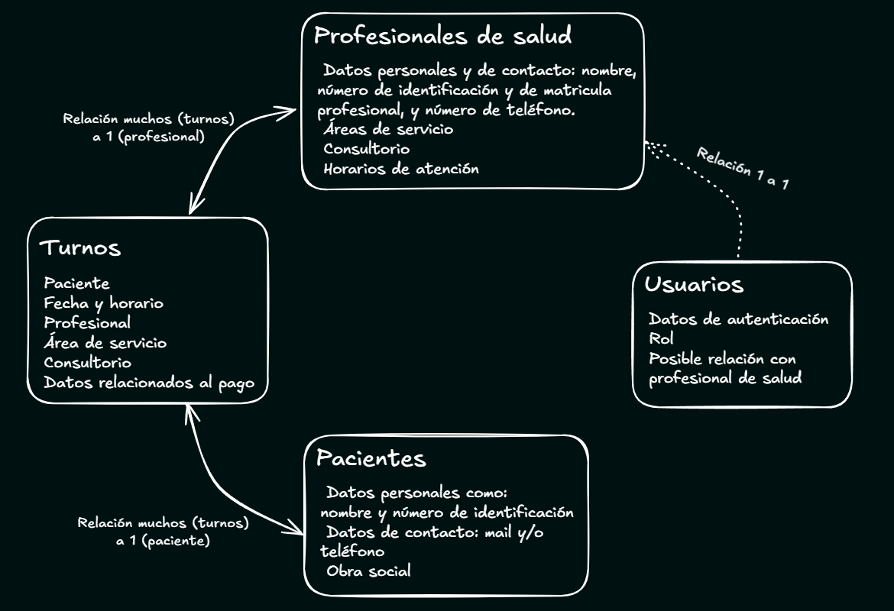

***[Español](#administrador-de-turnos-para-centro-de-salud) - [English](#health-center-appointment-manager)***

<!-- > **Instrucciones de instalación:** Una vez descargado el proyecto en su ordenador ejecute los siguientes comandos desde la carpeta raíz, y luego acceder a http://localhost:5173/ en el navegador:
>
> **Installation guide:** After downloading the project files run de next commands in the root folder terminal, then go to this link in your browser http://localhost:5173/:
> * npm install
> * npm run dev -->

<h1>Administrador de turnos para centro de salud</h1>

> La documentación está siendo actualizada, this documentation file is being updated

Este proyecto está pensado como una herramienta para ayudar en la gestión de turnos, entro otras cosas, en centros de salud como clínicas u hospitales. **Permite crear y gestionar turnos, así como también manejar datos de, pacientes, profesionales de salud y areas de servicio**.

Permite acceder a la información de forma sencilla mediante **búsquedas personalizadas y visualizaciones en tablas.** La información se registra a través de **formularios claros**, o herramientas prácticas que permitan realizar las acciones de forma gráfica y fácil de entender.

La página cuenta con varias opciones de seguridad. Una de ellas, de las más útiles en el uso diario que pueda tener, es la protección de datos utilizando la **sesión del usuario**. Es decir, según la cuenta que inicia sesión, y los roles que ésta tenga, son los datos que se pueden agregar, modificar, o eliminar.

**Índice**

## Fundamentación de Arquitectura y diseño de software
La aplicación entonces tiene como objetivo la gestión de turnos, tanto para secretarios como para profesionales. 

Está destinada a centros de salud, pero cada uno tendría su propia instancia de la misma. Es decir que no está pensada como una aplicación que estaría alojada en algún servidor remoto con acceso global, sino más bien a una aplicación de ejecución local. Y por lo tanto ésta debería trabajar con datos relacionados al ámbito de salud y para el fin mencionado. Lo que implicaría:

Que debe brindar:
- Una interfaz fácil de entender y de acceder a las distintas acciones que se quieran realizar.
- La posibilidad de tanto visualizar como de registrar turnos en el corto y largo plazo.
- El registro de pacientes y personal de salud.
- La asociación de esos pacientes y profesionales a los turnos.
- Permitir que cada profesional pueda acceder y manejar los turnos con los que se encuentre asociado.
- Dar la seguridad de que no se permitiría que los turnos se sobrepongan para un mismo profesional.

Y que el sistema debería:
- Poder guardar los datos de forma persistente en él.
- Además de una interfaz clara, éste debería tener su API que permita comunicarse con la base de datos de forma práctica.
- Que el lado de la interfaz y el lado del servidor estén en constante comunicación, y las operaciones puedan tener respuesta sincrónica.
- Guardar datos sensibles de forma segura, por ejemplo encriptando contraseñas y validando los parámetros que ingresan en las solicitudes.
- Trabajar con autenticaciones y autorizaciones en sus operaciones.
- Exponerse dentro de la red local, para que pueda ser accedida desde distintos dispositivos en el área del centro de salud.
- Realizar back-ups periódicamente para la conservación de datos.

### Estilo arquitectónico
Analizando las necesidades del proyecto se llegó a la conclusión de que la mejor opción para este caso sería un sistema monolítico, ya que no requiere de tanta complejidad ni está pensada una gran escalabilidad para este caso. Aprovechando entonces la facilidad de desarrollo y la simpleza en su infraestructura que permiten estos sistemas.

El proyecto, con esta arquitectura monolítica, constaría de:
- Una base de datos.
- Una API a la que accede la interfaz y que se comunica con la base de datos para las operaciones que los usuarios deseen realizar.
- Y una interfaz, capaz de mostrar y permitir realizar de forma clara todo el trabajo que está pensado para la aplicación.

### Modelo de dominio
Estando destinada a la gestión de turnos para centros de salud debería contar con las siguientes entidades como centro del proyecto: turnos, pacientes y profesionales de salud principalmente.

Como a la aplicación podrían acceder distintos usuarios, también se necesitaría de una entidad que maneje y guarde estos datos. Que serán usados para autenticarse y validar los distintos roles.

Aspectos adicionales que se asignaron o que se tuvieron en cuenta:
- Un profesional de salud puede estar registrado en más de un área de servicio si se requiere.
- Los consultorios solo pueden tener un profesional asignado.
- Entre los datos de pacientes estaría el de obra social. Dato que serviría también al momento de crear turnos.
- Es posible que en el centro de salud donde se use haya áreas que sean sin turnos fijos, sin fecha y horario, sino más bien por orden de llegada. Pero que igual se necesita registrar los datos de pacientes y de abono.

**Representación gráfica del modelo:**

#### Turnos
Esta entidad guardaría los datos que corresponden a cada turno. Relacionándose con pacientes, profesionales, asignando fecha, horario, consultorio, entre otras cosas.

Atributos:
- Paciente que solicita (Relación muchos a 1)
- Fecha
- Horario
- Área de servicio
- Profesional de salud (Relación muchos a 1)
- Consultorio
- Estado de pago (Pagado, Debe documentación, Debe, o A Reiterar)
- Obra social (si aplica se le asignaría la que tiene el paciente)

#### Pacientes
Entidad destinada a cada paciente, se registraría uno nuevo cada vez que alguien pide un turno por primera vez en el centro de salud.

Atributos:
- Nombre completo
- DNI (o número de identificación según corresponda el país)
- Número de teléfono
- Obra social

#### Profesionales de salud
Encargados de tener asociados los turnos que le corresponden, además de datos personales y profesionales. Pudiendo manejar también sus propios turnos

Atributos:
- Nombre completo
- DNI (o número de identificación según corresponda el país)
- Número de teléfono
- Número de matricula profesional
- Áreas de servicio (El profesional puede estar en distintas áreas según su formación e infraestructura del centro de salud)
- Consultorio (1 profesional solo puede tener 1 consultorio para este caso)
- Horarios de atención

#### Usuarios
Que servirán para guardar los datos relacionados a autenticaciones al sistema. Lo que según el rol del usuario se habilitarían distintas funciones.

Atributos:
- Nombre de usuario
- Contraseña
- Rol
- Email (para recuperación de datos)
- Profesional de salud (En caso de que esté relacionado con uno. Relación 1 a 1)

### Resumen de tecnologías y herramientas elegidas
| Tecnología / herramienta | Comentario adicional |
| - | - |
| Java y Spring Boot | 
El uso de este conjunto aporta varias facilidades.
 
Por el lado del lenguaje, Java, brinda la madurez y soporte que posee, además de que es común su uso aplicaciones.
 
Y con respecto a Spring Boot, éste brinda la facilidad de sus configuraciones automáticas en sus componentes y del despliegue de aplicaciones Java. También ofrece distintos módulos que se requerían en este proyecto. Pensando principalmente en el de seguridad, Spring Security; además de otros que sirven para desarrollar gateways, APIs REST y GraphQL, y trabajo con bases de datos relacionales.
 |
| Spring security | Fundamental para manejar las autenticaciones, autorizaciones, validaciones y algunas protecciones necesarias para la seguridad de la aplicación. |
| API Rest | Elegida ya que es la que más se adapta al proyecto debido a su que forma de comunicación y obtención de respuestas es sincrónica, necesaria para esta aplicación. Además no es fundamental el filtrado de datos enviados o recibidos de las solicitudes a la API, por lo que no hacen falta tecnologías como GraphQL. |
| Base de datos Relacional - MySQL | Las bases de datos relacionales son ampliamente usadas en entornos como para el que está pensada la aplicación, debido a las relaciones que permiten y la estructura que le brinda a sus componentes. |
| TypeScript | Aporta estructura y rigidez a todo el frontend, lo que hace que se sincronice con las características del backend en Java. |
| React | Se eligió React por su enfoque en componentes reutilizables, rendimiento mediante Virtual DOM, ecosistema maduro, compatibilidad con Typescript, y amplia comunidad. Esto lo hace ideal para una aplicación que requiere interfaces dinámicas, y fáciles de mantener. |
| React Router | Librería especial de React focalizada en el enrutamiento de la aplicación. |

### Patrón arquitectónico
El sistema implementa una arquitectura en capas cliente-servidor que, en producción, se despliega como un único monolítico estilo MVC. La capa de presentación (React) se empaqueta y sirve a través de Spring Boot, mientras que las capas de aplicación, dominio y acceso a datos se mantienen en el backend.

Esto permite la separación de responsabilidades, haciendo que cada una tenga un propósito claro y su lógica esté separada. Lo que también permite escalabilidad y mantenimiento:
- El modelo gestionaría los datos y toda la lógica relacionada a ellos. 
- La vista, mediante el frontend en React, se encargaría de mostrar una interfaz clara al usuario final.
- Y el controlador, siendo el intermediario entre las otras dos capas.

#### Capa del modelo
Esto incluye, de forma dividida las capas de servicio, de repositorio, y de base de datos.

- ##### Capa de servicio
  Esta se comunica con la de repositorio y se encarga de realizar todo lo necesario para que los datos sean procesados ya sea desde o hacia la base de datos. Se realizan las validaciones, conversiones y toda la lógica de negocio.
- ##### Capa de repositorio
  Funciona de mediador entre la de servicio y la base de datos. Mandando solicitudes a ella ya sea de lectura o de escritura.
- ##### Capa de base de datos
  En la que se almacena la información persistente de la aplicación. Consta de las siguientes entidades:
    - Turno:
      - id
      - paciente (Parámetro obligatorio)
      - fecha (Parámetro obligatorio)
      - horario (Parámetro obligatorio)
      - areaProfesional (Relación muchos a uno - Parámetro obligatorio)
      - metodoDeAbono
      - obraSocial
      - estadoPago (enum)
      - comentario
      - consultorio (Relación muchos a uno - Parámetro obligatorio)
      - active (Booleano que representaría si el turno está en vigencia o fue cancelado, o dado de baja - Parámetro obligatorio)
    - Paciente:
      - id
      - nombreCompleto (Parámetro obligatorio)
      - dni (Parámetro obligatorio)
      - numeroContacto (Parámetro obligatorio)
      - obraSocial
    - Profesional Médico
      - id
      - nombreCompleto
      - dni
      - numeroContacto
      - matricula
      - areas
      - consultorio
      - horarios
      - active (Agregado en caso de que el médico no esté activo en cierto momento, permitiendo conservar sus datos pero que no se le puedan asignar turnos)
    - Áreas de servicio (definido como entidad debido a que necesita relacionarse tanto con los turnos como con los profesionales)
      - id
      - nombre
      - searchName (usado para lógica interna, facilitando obtención de datos)
      - necesitaTurno (Booleano que representa si el área requiere de turnos fijos o no)
      - active (Agregado en caso de que el médico no esté activo en cierto momento, permitiendo conservar sus datos pero que no se le puedan asignar turnos)
    - Consultorio (definido como entidad por las relaciones que tendría con otras entidades)
      - id
      - numero

#### Capa de vista
Implementada a traves del frontend con React y Typescript. Se encarga de mostrar y permitir al usuario final, el personal de centros de salud, realizar de forma cómo y sencilla las operaciones que posee la aplicación.

##### Vistas
Las vistas son aquellas que dividen las operaciones permitidas, y generalmente, cada una tiene un fin único para poder brindar una mejor experiencia al usuario. 

- Vista inicial - Turnos del día
  
  El sistema detectará automáticamente los turnos de la fecha actual. Filtrándolos por área de servicio y separados por horarios según los profesionales de ella.

  Esta puede variar según el usuario que ingresa. Ejemplo si ingresa un profesional de salud específico éste solo verá los turnos que tiene asociados a él en el día actual. En cambio si es el secretario mostraría todos los turnos del centro de salud, filtrados por área.
- Búsqueda de turnos
  
  Como su nombre lo índica permite buscar turnos, ya sean futuros o pasados. La búsqueda permite hacerlo por los atributos de los turnos, ej: nombre del paciente o del profesional, fecha, área de servicio, estado de pago del turno, entre otras. 

  Los resultados se muestran en tablas, permitiendo seleccionar y realizar acciones sobre ellos. Por ejemplo: darlos de baja, eliminarlos, o editarlos (lo que abriría un modal, o pudiendo ser también un enlace, con las mismas características de la *vista de creación de turnos*. Pero con los datos del turno a editar incluidos).
- Creación de turnos
  
  Consta de un formulario sencillo y con el agregado de un calendario. En él se muestran por día, cada horario disponible del área y profesional seleccionado mostrando cuáles están disponibles y cuáles ya están solicitados.

 

- Creación de pacientes
  
  Requerido para registrar turnos en caso de que el paciente no esté registrado antes.
- Búsqueda de pacientes
  
  Muestra los resultados en tablas, permitiendo ver sus datos y los turnos que tienen asociados. Al igual que realizar acciones sobre ellos.

 

- Creación de profesionales
  
  Necesario para que se le puedan asignar turnos. También si se quiere asignar este profesional a una cuenta de usuario.
- Búsqueda de profesionales

  Al igual que la de pacientes muestra los resultados en tablas permitiendo hacer operaciones sobre ellos.

 

- Registro de usuario

  Formulario para el registro, que además permite la vinculación de un profesional de salud a la cuenta.
- Inicio de sesión
- Perfil de usuario

  Muestra la información principal del usuario, permitiendo editarlos.

#### Capa de controlador
Permite redirigir las solicitudes del cliente al sistema a la capa de modelo.

### Entornos

## Instrucciones de instalación y requisitos

## Autenticación

## Características generales y casos de uso

### Acerca de los usuarios...
  (* Hay 3 roles para los usuarios que se registren: Administrador, General y Profesional.
  -* El Administrador puede crear, modificar o dar de baja cualquier dato que este presente en la base de datos de la aplicación.
  -* El **rol "General" es el que usaría quien este a cargo de registrar los turnos y pacientes**, contando también con la posibilidad de modificarlos
  -* Los usuarios con **rol "Profesional"** están destinados a los profesionales de salud, **permitiéndoles visualizar y manejar sus turnos de forma más directa.** Así como sus propios datos.
  -* Cualquier usuario, o incluso sin iniciar sesión, podrá visualizar los datos que quiera. Pero modificarlos, o crear nuevos, depende del rol.)

  (eso iría en la sección de autorizaciones y autenticaciones)

  * Para que la navegación sea más práctica, solo aparecerán los enlaces en el menú a los que el usuario en sesión puede acceder.  

### Acerca del manejo de datos...
    * (Esto en explicación de los procesos - ver dónde iría eso)
  * La búsqueda de cada tipo de dato cuenta con filtros y búsquedas personalizadas para cada uno.
  * **El registro o modificación de datos cuenta con verificaciones** que comprueban que no se sobreponga con otros, entre otras **validaciones**. Mostrando mensajes de error si algún dato en específico causaría este problema.
  * **En caso de que haya errores se mostrarán en pantalla.**
  * Tanto la creación como la modificación de turnos muestra un calendario en el que puedes seleccionar el horario y la fecha de forma más sencilla. A su vez que muestra los turnos ya ocupados para el área seleccionada y profesional.
  * Si quien crea un turno es un profesional, solo podrá hacerlo para las áreas en las que él se encuentre registrado. Y en cuánto a la modificación, 
  solo aquellos turnos que ya tenga asignados, y también solo para las áreas mencionadas.
  * Cuando se da de baja un area de servicio o profesional se puede elegir qué hacer con los turnos que estén asociados. Pudiendo darlos de baja también.

### Acerca de los datos...
  * La sección principal muestra los turnos del día para cada área, o para las áreas en que un profesional esté registrado si el usuario en sesión tiene el rol "Profesional". (Para donde se expliquen las vistas)

## Características técnicas
  * Base de datos relacional SQL
  * Desarrollo de una API REST
  * Arquitectura cliente-servidor. Comunicación con la API a través de solicitudes HTTP
  * Api con protección CORS específica
  * Sesión de usuario, registro y roles con diferentes permisos. Tanto para la api como para la página
  * Encriptado de contraseñas de usuario mediante el codificador BCrypt
  * Generación y utilización de token CSRF para proteger ante posibles ataques de seguridad a la base de datos
  * Verificaciones y validaciones tanto en el back como en el front
  * Excepciones personalizadas y envío de DTOs para mejorar la comunicación de errores y manejarlos en el frontend
  * Aplicación de principios SOLID
  * Componentes reutilizables
  * Visualizaciones en tablas, registros en formularios, y búsqueda dinámica de datos
  * Diseño responsivo
  * Desarrollo de pruebas unitarias

  ### Tecnologías aplicadas
  * HTML
  * CSS
  * TypeScript
  * React.js
  * Java
  * MySQL
  * Spring Boot
  * Spring Security

## Comentarios del proceso
Luego de completar un curso de desarrollo web de más de un año y medio, buscaba un proyecto donde pudiera aplicar de forma integral los conocimientos adquiridos. Quería una aplicación completa, con base de datos, una interfaz intuitiva y una API que conectara todos los componentes de manera segura, escalable y práctica.

Con esto en mente, me propuse diseñar una herramienta que facilite la programación de citas para pacientes, optimice la asignación de profesionales y consultorios, y mejore la eficiencia en la gestión de una clínica o centro de salud.

Sin embargo es importante aclarar que tuve que profundizar, estudiar y poner en práctica muchos conceptos que no había visto en el cursado.Por lo que tuve que poner empeño en buscar información, entender y aclarar mis dudas a través de recursos de la web y compañeros. Como documentaciones oficiales, libros, foros, información multimedia e incluso tomar otros cursos. 

Por ejemplo, aunque tenía experiencia en JavaScript y Java, este fue mi primer proyecto usando TypeScript. Lo mismo con la seguridad web a través de Spring Security, fue todo un desafío comprender y poder aplicar las medidas de seguridad que requería un proyecto con estas características, fue un reto que requería mucha más profundidad de la que había visto en mi cursado.

Desde el principio busqué mantener el código lo más organizado posible, limpio y fácil de leer, ya que mi idea era incluirlo en mi portafolio. Aunque planeo seguir puliendo detalles y sumando mejoras, me propuse publicar una versión estable que demuestre mis habilidades para así poder darle seguimiento a otros proyectos y priorizar mi perfil profesional y búsqueda laboral.
___
 
 

<h1>Health center appointment manager</h1>
The objective of this project was apply and show my acquired knowledge and skills for web developing. 

It is designed as an application that **allows users to create and manage appointments, as well as handle data related to patients, healthcare professionals, and service areas**. Essential tools for any healthcare center, presented in a practical and user-friendly way.

It enables easy access to information through **customized searches and table views**. Information is recorded via **clear forms**, along with practical tools such as a calendar displaying scheduled appointments by day and time.

The page offers various security options. One of the most useful for daily use is data protection through **user session management**. That is, the data that can be added, modified, or deleted depends on the logged-in account.

**Index**

## Features and use cases

### About users...
  * There are three roles for registered users: Administrator, General, and Professional.
  * The Administrator can create, modify, or remove any data in the application database.
  * The **"General" role is intended for the responsible for scheduling appointments and registering patients**, with the option to modify them as well.
  * Users with the **"Professional" role** are designated for healthcare professionals, **allowing them to view and manage their appointments more directly**, as well as their personal data.
  * Any user, or even without logging in, can view the available data. However, modifying or creating new data depends on the role.
  * To streamline navigation, only the links accessible to the logged-in user are shown in the menu.

### About data handling...
  * Each type of data search has filters and custom searches for each category.
  * **The creation or modification of data includes validations** to prevent conflicts with existing entries and **other checks**, displaying error messages if any specific data could cause an issue.
  * **If there are errors, they will be displayed on the screen.**
  * Both appointment creation and modification display a calendar where you can select the date and time more easily, showing already booked appointments for the selected area and professional.
  * If an appointment is created by a professional, they can only schedule it for the areas in which they are registered. For modification, they can only adjust appointments assigned to them, and only for the mentioned areas.
  * When a service area or professional is removed, you can choose what to do with the associated appointments, including removing them as well.

### About the data...
  * The main data types are patients, professionals, service areas, consultation rooms, and appointments. **These are linked according to the database structure.**
  * The main section displays the day's appointments for each area, or for the areas in which a professional is registered if the logged-in user has the "Professional" role.
  * A healthcare professional can be registered in more than one service area if needed.
  * Consultation rooms can only have one assigned professional.
  * Patient data includes information on health insurance, which is automatically recorded when an insurance is assigned to an appointment.
  * Appointments can be classified based on payment status as: Paid, Documentation Pending, Owed, or To Reschedule.

### About views and pages...
  * It has different color themes which is assigned by the user preference in the browser (light and dark themes).
  * The structure and design of the pages are according to the screen size.

## Technical features
  * SQL relational database
  * Build of an Rest API
  * Client-Server architecture. The communication with the API is by HTTP requests
  * API with specific CORS protection
  * User sessions, registration, and roles with different permissions for both the API and the webpage
  * Encryption of user passwords by BCrypt password encoder
  * Generation and use of CSRF tokens to protect against potential database security threats
  * Validations on both backend and frontend
  * Custom exceptions and DTOs for improved error handling and communication with the frontend
  * SOLID principles applied
  * Reusable components
  * Table views, form registrations, and dynamic data searches
  * Responsive design
  * Development of unit tests

### Used technologies
  * HTML
  * CSS
  * TypeScript
  * React.js
  * Java
  * MySQL
  * Spring Boot
  * Spring Security

## Comments about the developing process
After completing a year-and-a-half web development course, I sought a project where I could fully apply the knowledge gained. I wanted a comprehensive application with a database, an intuitive interface, and an API that connects all components in a secure, scalable, and practical way.

With this in mind, I set out to design a tool that facilitates appointment scheduling for patients, optimizes professional and room assignments, and enhances efficiency in managing a clinic or healthcare center.

It’s worth noting that I had to dive deeper into many concepts not covered in the course. I invested time in researching, learning, and clearing up doubts through peers or web resources like official documentation, books, forums, multimedia resources, and even other courses.

For example, although I had experience in JavaScript and Java, this was my first project using TypeScript. Likewise, web security through Spring Security was challenging, implementing the necessary security measures for this project required much more depth than I had encountered in the course.

From the start, I aimed to keep the code organized, clean, and readable, as I plan to include it in my portfolio. While I intend to continue refining it and adding improvements, I wanted to publish a stable version that demonstrates my skills, allowing me to shift focus to other projects and prioritize my professional profile and job search.
